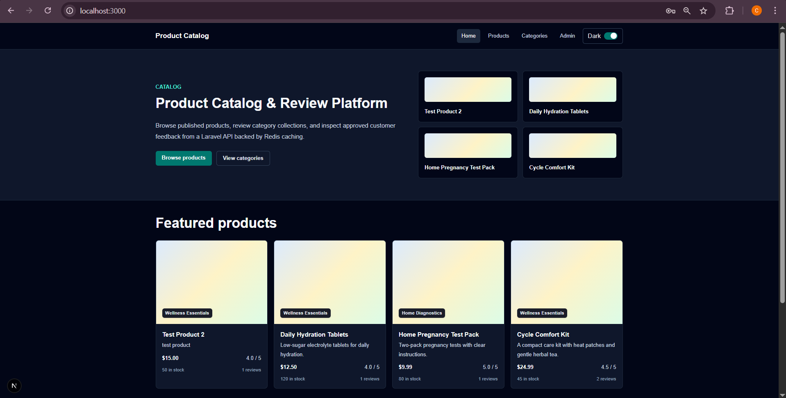
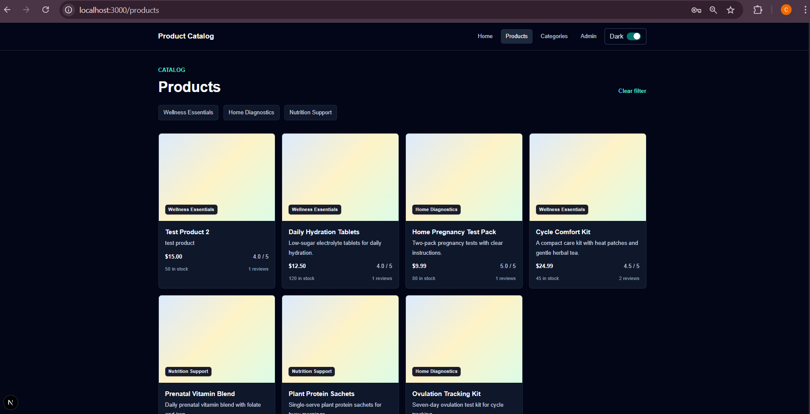
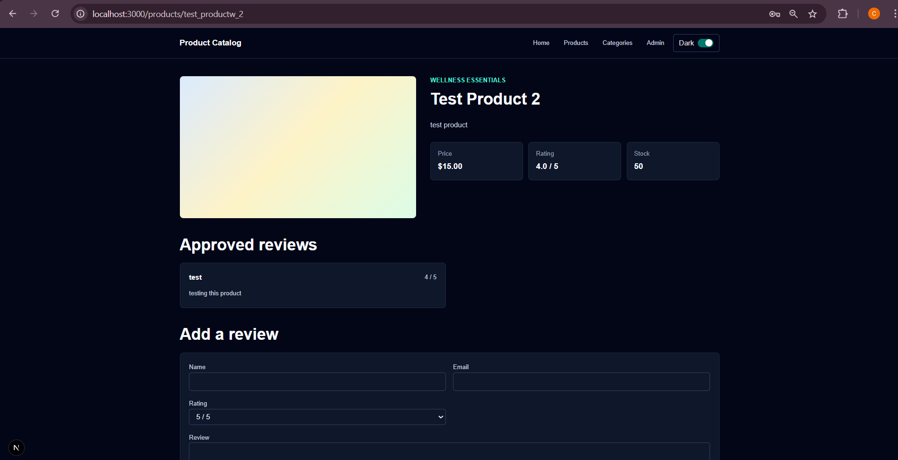
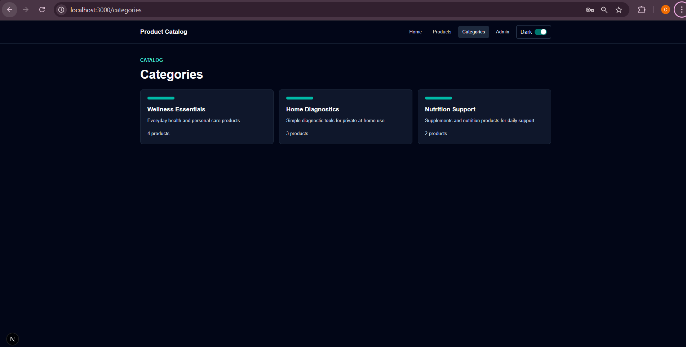
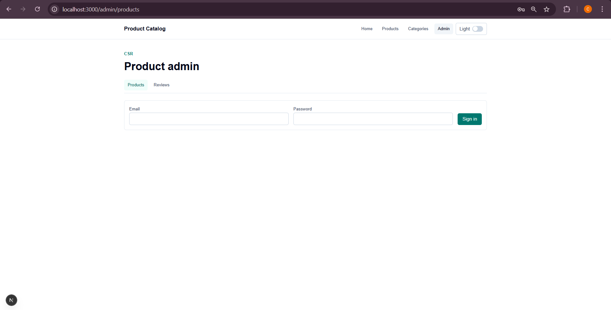

# Fullstack Product Catalog

Full-stack product catalog and review platform built with a Laravel API, PostgreSQL, Redis, and a Next.js App Router frontend.

The project is intentionally split around clear ownership boundaries:

- `backend/` owns persistence, validation, authentication, caching, and API response contracts.
- `frontend/` owns public catalog rendering, admin workflows, TypeScript API contracts, and responsive UI.
- `swagger.yaml` documents the HTTP API surface.

## Stack

- Backend: Laravel, Eloquent, Sanctum, PostgreSQL, Redis
- Frontend: Next.js App Router, React, TypeScript, Tailwind CSS
- Tooling: Docker Compose, Jest, React Testing Library, Drizzle schema types

## Screenshots



| Products | Product detail |
| --- | --- |
|  |  |

| Categories | Admin products |
| --- | --- |
|  |  |

## Quick Start

Prerequisites:

```text
Docker Compose
```

For non-Docker development, use PHP 8.3+, Composer, Node 20+, npm, PostgreSQL, and Redis.

### 1. Install dependencies

If you want local editor tooling, tests, and non-Docker commands available, install backend and frontend dependencies first:

```bash
cd backend
composer install

cd ../frontend
npm install

cd ..
```

Docker-only users can skip this step because the backend and frontend images run `composer install` and `npm install` during `docker compose up --build`.

### 2. Copy environment files

From the repository root:

```bash
cp .env.example .env
cp backend/.env.example backend/.env
cp frontend/.env.example frontend/.env
```

### 3. Update environment values

Update the root `.env` for the PostgreSQL service:

```text
DB_DATABASE=
DB_USERNAME=
DB_PASSWORD=
```

Update `backend/.env` so Laravel points at the Docker services:

```text
APP_KEY=

DB_CONNECTION=pgsql
DB_HOST=db
DB_PORT=5432
DB_DATABASE=
DB_USERNAME=
DB_PASSWORD=

CACHE_STORE=redis
REDIS_HOST=redis
REDIS_PORT=6379
```

Update `frontend/.env` for browser and server-side API access:

```text
NEXT_PUBLIC_API_URL=http://localhost:8000/api/v1
API_URL=http://backend:8000/api/v1
```

`NEXT_PUBLIC_API_URL` is used by browser-side admin requests. `API_URL` is used by server-rendered Next.js routes inside Docker, where the Laravel container is reachable by service name as `backend`.

### 4. Start the stack

From the repository root:

```bash
docker compose up -d --build
```

### 5. Prepare Laravel

Generate the Laravel app key if `APP_KEY` is empty, then run migrations and seeders:

```bash
docker compose exec backend php artisan key:generate
docker compose exec backend php artisan migrate --seed
docker compose exec backend php artisan cache:clear
```

### 6. Open the app

Open:

```text
Frontend: http://localhost:3000
API:      http://localhost:8000/api/v1/health
```

Default admin credentials:

```text
Email: admin@example.com
Password: password
```

These credentials are seeded for local development only.

## Environment

The Docker quick start above is the recommended setup path. This section explains what each environment file controls.

Root `.env` is used by the PostgreSQL service:

```text
DB_DATABASE=
DB_USERNAME=
DB_PASSWORD=
```

`backend/.env` should point Laravel at the Docker services:

```text
DB_CONNECTION=pgsql
DB_HOST=db
DB_PORT=5432
DB_DATABASE=
DB_USERNAME=
DB_PASSWORD=

CACHE_STORE=redis
REDIS_HOST=redis
REDIS_PORT=6379
```

`frontend/.env` separates browser and server-side API access:

```text
NEXT_PUBLIC_API_URL=http://localhost:8000/api/v1
API_URL=http://backend:8000/api/v1
```

`NEXT_PUBLIC_API_URL` is used by browser-side admin requests. `API_URL` is used by server-rendered Next.js routes inside Docker, where the Laravel container is reachable by service name as `backend`.

If running the frontend directly on the host instead of Docker, use:

```text
API_URL=http://localhost:8000/api/v1
```

For local, non-Docker Laravel development, `backend/.env` should use your host database and cache settings instead of Docker service names.

## Backend

With Docker, backend setup is:

```bash
docker compose exec backend php artisan key:generate
docker compose exec backend php artisan migrate --seed
docker compose exec backend php artisan cache:clear
```

For local, non-Docker backend development, run from `backend/`:

```bash
composer install
php artisan key:generate
php artisan migrate --seed
php artisan serve --host=0.0.0.0 --port=8000
```

Important API behavior:

- Public reads are available for categories and published products.
- Product, category, and review mutations require a Sanctum bearer token.
- Admin login is available at `POST /api/v1/auth/login`.
- Public review submission is available at `POST /api/v1/reviews`.
- Public review submission is throttled to 5 requests per minute.
- API errors use a consistent envelope:

```json
{
  "message": "The given data was invalid.",
  "errors": {}
}
```

## Frontend

Install and run locally from `frontend/`:

```bash
npm install
npm run dev
```

Build and start:

```bash
npm run build
npm run start
```

Useful checks:

```bash
npm run lint
npx tsc --noEmit
npm test -- --runInBand
```

Public routes:

```text
/                    Home page with featured products and categories
/products            Product listing with category filtering
/products/[slug]     Product detail with approved reviews
/categories          Category listing
/categories/[slug]   Category detail with products
```

Admin routes:

```text
/admin/products      Product CRUD and publish toggle
/admin/reviews       Review list, approve/reject, delete
```

The admin UI signs in with email/password, stores the returned Sanctum token in `localStorage`, and sends it as a bearer token for protected API requests.

## Caching Strategy

Caching is deliberately placed in the Laravel service layer rather than in controllers. Controllers stay thin and HTTP-focused, while services own query shape, cache keys, and invalidation.

Cache keys are explicit and resource-scoped:

```text
categories.list.page.{page}
categories.detail.{slug}
products.list.page.{page}.category.{category}.visibility.{visibility}
products.detail.{slug}
reviews.list.page.{page}
reviews.detail.{id}
```

Redis cache tags are used when the store supports them. The services fall back to the default repository when tags are unavailable, which keeps the code portable while still taking advantage of Redis in Docker.

Mutation invalidation is broad enough to stay correct:

- Category changes flush category and product caches.
- Product changes flush product, category, and review caches.
- Review changes flush review and product caches.

That is intentional. The catalog is read-heavy and small enough that correctness is better than trying to surgically expire every affected key.

HTTP cache headers mirror data volatility:

- Categories: `public, max-age=300`
- Public products: `public, max-age=60`
- Protected/admin reads: `private`
- Auth responses: `no-store`

## SSG and ISR Decisions

The frontend uses server components for public catalog reads and client components for admin workflows.

Product pages use a shorter ISR window:

```text
Products: 60 seconds
```

Product availability, publication state, price, stock, and review aggregates can change more often, so the product cache is intentionally fresher.

Category pages use a longer ISR window:

```text
Categories: 300 seconds
```

Category metadata changes less often, and the backend cache uses the same 300 second TTL for category responses.

Detail pages use `generateStaticParams()` to pre-render known product/category slugs at build time. They also call `notFound()` when the API returns a missing resource. Product detail pages additionally reject unpublished products for public views.

This gives fast public catalog pages without pretending the catalog is immutable. Backend cache invalidation handles API freshness; ISR handles frontend regeneration.

## Type Contracts

The frontend includes a Drizzle schema in `frontend/src/db/schema.ts`. There is no live frontend database connection; the schema is used as a TypeScript contract that mirrors the backend tables.

`InferSelectModel` and `InferInsertModel` provide shared base types for:

- API response models
- admin form values
- moderation payloads

This avoids maintaining unrelated hand-written TypeScript interfaces as the data model evolves.

## Tests and API Docs

Frontend tests:

```bash
cd frontend
npm test -- --runInBand
```

Backend tests:

```bash
docker compose exec backend php artisan test
```

When running backend tests outside Docker, make sure the required PDO driver is installed for the configured test database.

The full API contract is documented in:

```text
swagger.yaml
```

Open `swagger.yaml` in Swagger Editor or any OpenAPI viewer to inspect the API interactively.

## Operational Notes

If the frontend shows stale catalog data after reseeding, clear backend cache and restart the frontend:

```bash
docker compose exec backend php artisan cache:clear
docker compose restart frontend
```

If Next serves an old client bundle during local development:

```bash
docker compose down
rm -rf frontend/.next
docker compose up -d --build
```
